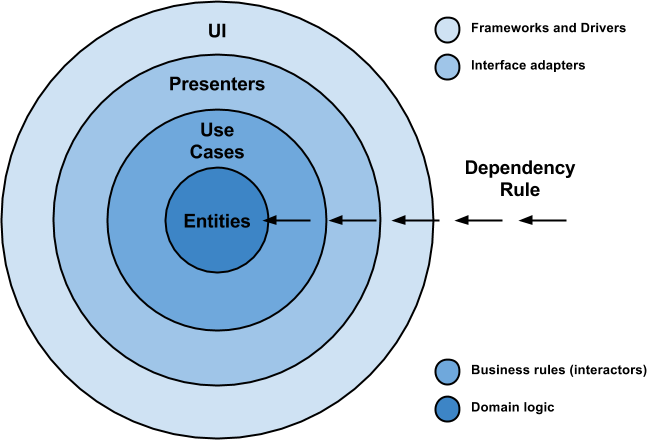
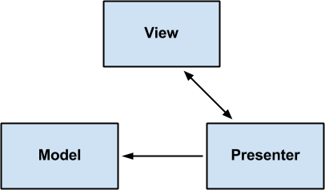

## 安卓应用架构思考
前言：最近在写一个新的安卓应用，想在这个应用中尝试新的技术栈。由于平时工作原因，对各类技术框架也有一定的了解与比较，所以选库方面进展很快，几天就完成了网络库、图片库、事件驱动等等基本库的选型。关于选库先不在这里作讨论了。当真正在开始写代码的时候，就发现了如何构建不同的层级结构是一个非常值得思考的问题，层级结构对后期代码维护有非常大的影响。而且由于种种原因，很难再去重建项目。这也就体现了早期构建一个优雅的应用架构的重要性。

### 软件架构基本原则
**所谓的软件架构都是由无数开发者总结出来的经验：这不仅仅关于满足基本需求，还关乎软件的健壮性、可测试性、可维护性、灵活性（便于扩展）。**我想那些踏过无数坑的工程师才会对这些特征的重要性有切身体会吧。由于本人经验有限，现只能汲取前人的经验，总结出一个优雅的软件架构应该具备的优秀特征：
* **独立于框架**
* **便于测试**
* **独立于UI**
* **独立于数据库**
* **独立于任何外部代理**

上图是现在要介绍的基本的软件架构图。每一个圈都代表一个层级，在真正的应用中可以根据自己的项目规模适当精简，但这里有一个基本的依赖法则：各层级的依赖只能是从外向内，绝对不能反向依赖，因为内层不应该知道外层的逻辑，原则上内层只需要提供接口给外层就行。接下来我们根据此图来介绍这个软件架构的工作原理，先介绍几个术语：
* **Entities：**应用的业务实体
* **Use Cases：**完成了业务逻辑和实体数据的转换
* **Presenters：**主要是用来做UI层和业务逻辑层的数据适配
* **UI：**包含所有的UI细节

上面是对一般应用软件的基本层级依赖总结，基本阐述了各层级的作用于依赖关系。对于不同平台会有不同的实现，下面我将针对这种软件架构思想介绍它在安卓中的应用。

### 安卓应用架构
整体架构分为3层，由外向内分别为：Presentation Layer（显示层）--> Domain Layer（业务层）--> Data Layer（数据层）。各个层级的通信通过接口显现，内层不需要知道外层的任何细节。在这个架构中，Domain Layer是可选的，这个层级非常灵活，可以根据具体的项目规模与特点来对这个层级做调整。在这里，我先介绍每个层级的作用，然后再介绍如何对Domain Layer做调整。

#### Presentation Layer
这个层级在安卓中就是安卓应用的UI层了，关于这个层级的设计，已经有比较成熟的实现方案，这就是我们熟悉的MVP设计模式。通过Presenter控制View层和Model层的交互，隔离了View和Model，这样View不用再关心数据来源，只是单纯的显示数据。Presenter承担了大部分的控制逻辑，所以当控制逻辑变得复杂时，它会变得臃肿，这也就出现了MVVM，在这里不再对其做描述了。
强烈推荐使用MVP来实现这个层级，它已经被广大开发者所熟悉，代码的可读性和可维护性将极大的提高。

总之，Presentation Layer整体都是显示层，对数据的控制较少，主要依赖Domain Layer提供的数据做显示逻辑。如果应用对架构没有太高的要求，可以通过扩展MVP实现整体的架构，当然，这样也就基本失去开头描述的所有软件架构的优势与优雅。

#### Domain Layer
在整体架构中，这个层级是用来处理业务逻辑的。之所以说这个层级灵活，是因为它可以完全脱离安卓系统独立存在。它是一个纯java实现的层级，也就是说，它能独立运行在JVM上。这样就极大的方便测试和重用。我们可以利用通用的java测试框架对这个层级做单元测试，不需要安卓框架的支持，也不关心UI逻辑。假如有其他的java平台有需要，可以直接把这部分代码来过去用，不用再写业务逻辑了。

在这个层级中，可以封装独立的业务实体，所以即便数据层的实体发生改变，也不会对这层的逻辑处理产生影响。这样做，其实就是解耦了数据与业务逻辑。不过，这样一来需要做一个业务逻辑实体和数据实体的mapping。处理起来会相对麻烦一些。所以，但业务逻辑不是足够复杂，数据实体也不会频繁更新的话，没有必要做这个处理。

上面说这个层级是可以适当调整的，除了可以去掉封装独立的业务实体外，也可以去掉独立java平台的封装。原因有两点：
* 独立的java平台单元测试不是必须的
* 很少会有其他平台会重用这个层级

虽然独立平台听起来很灵活，但是具体应用很少有这个需求的。我个人是反对过度设计的，当投入与产出不成正比时，那也就没有必要再花费大量精力去设计这个层级了。
我自己的应用是将这个层级转换成一个链接层，用来链接Presentation Layer与Data Layer。它真正的作用是提供UI层接口，隔离数据的具体来源。但是如果单纯的只是这个作用，也是完全是可以把这部分逻辑写在Data Layer, 让Data Layer提供Presentation Layer需要的数据接口。但这样一来，我觉得有些耦合，所以还是独立出来这一层，而且它也是纯java实现，也方便以后做单元测试。：）

#### Data Layer
这个层级的作用就是提供数据给Domain Layer。可以由外层定义一个接口，然后在这个层级做具体的实现，这样就隔离了它与Domain Layer。
数据层可以说是一个影响性能的层级，所以，这个层级的实现直接关乎了整个应用的体验。但这个层级的设计是很清晰的，基本上都会有一层memory cache，缓存数据要么来自本地，要么来自网络。这其中的难点就是，如何做到缓存与持久化，网络数据同步。在安卓应用中这部分的工作需要在非主线程上做，所以对线程同步设计要求比较高。由于本篇主要介绍架构，关于如何做同步，这个先不在这里做详细的讲解了。

### 应用包结构图

上图是我的项目包结构图，基本实现了上面介绍的架构。我还是强烈推荐大家试一试这个架构，层次结构还是非常清晰的，可读性也很高。而且也可以针对不同层级做测试。但这个结构对单元测试的支持性不太好，我并没有在Domain中把每个用例做成一个接口，而是把逻辑相关的业务都放在一个Actor中，这样Actor会做不同的事，单元测试也就相对麻烦。之所以这样做，完全处于目前这个项目不需要，但是如果你自己的项目规模足够大。那么还是很有必要为每个用例设计不同的接口的。
至于项目中还会有些其他的类，在这里就不做介绍了，后面我会写相关文章介绍各个模块用到的技术和具体实现。

### 总结
通过对这个架构的实验，发现这种软件架构还是有许多优势的：
* **容易维护**
* **容易测试**
* **高内聚**
* **低耦合**

通过多些一点点代码带来这么多好处，这就是软件架构的令人着迷的地方。
如果你正好需要一个良好的安卓软件架构.
Give it a try :)
